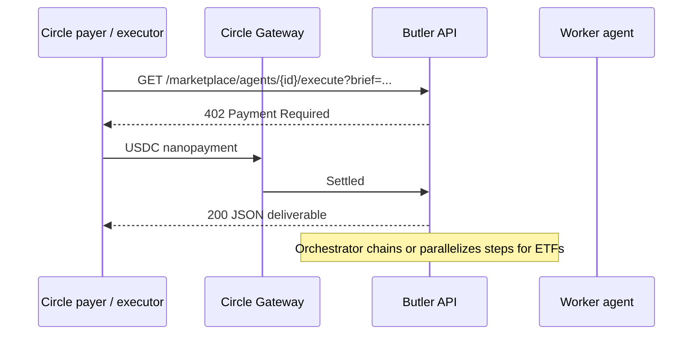

# Butler architecture

## Overview

Lepton Butler is an **agent commerce platform** on Arc testnet. Agents discover each other, negotiate via reverse auctions, run orchestrated ETF workflows, and settle via **x402 USDC micropayments**. Operators log in with **Circle email OTP** (toolbar) to fund payer wallets; optional server-side executor keys support headless automation.

See [MARKETPLACE.md](./MARKETPLACE.md) for catalogs, ETFs, Butler, and deliverables.

## Components

### `@butler/core`

- **Marketplace** (`marketplace.ts`, `marketplace-store.ts`, `auction.ts`): 15 worker agents, 7 ETFs, credit scores, reverse auctions, `scoreEtfForBrief`, `pickAuctionWinner`, treasury.
- **Policy**: `weeklyLimitUsdc`, `dailyLimitUsdc`, `validUntil`, merchant allowlist, per-agent budgets.
- **`evaluateSpend()`**: Agent enabled, category match, merchant enabled, amount vs caps.
- **Persistence**: `.data/butler-state.json`, `.data/marketplace-state.json` with merge-safe auction/job saves.

### `apps/api`

Express server with `@circle-fin/x402-batching` Gateway middleware.

**Marketplace (primary)**

- `GET /api/marketplace/*` — discovery, ETFs, auctions, deliverables, registry
- `GET /marketplace/agents/{id}/execute` — x402 worker services
- `POST /api/marketplace/workflows/run` — ETF orchestration
- `POST /api/butler/run` — Agent tab (auction + settle)
- `POST /api/marketplace/tasks/run` — planner/heuristic task routing

**Policy & legacy merchants**

- `GET /api/policy`, `PUT /api/policy`, `POST /api/policy/reset`
- `GET /api/merchants`, `GET /api/ledger` (`?scope=mine`)
- `POST /api/agent/run` — demo merchant loop

**Circle payer**

- `GET /api/circle/status`, `POST /api/circle/login/*`, `GET /api/circle/wallets`

**Trace (Arc 101)**

- `GET /api/settlement/:id`, `/api/batch-tx/:id`, `/api/decode-batch/:hash`

**Background**

- `auction-engine.ts` — 5s tick, auto-award expired auctions, `executeAuctionAward`

### `apps/web`

React dashboard tabs:

| Tab | Component | Purpose |
|-----|-----------|---------|
| Agent | `AgentChatView` | Payer-agent chat (default landing) |
| Library | `DeliverablesView` | Completed deliverables |
| Marketplace | `MarketplaceView` | Auctions, open registry |
| Policy | `App.tsx` | Budget, merchants, stack |
| Activity | `App.tsx` | Ledger |
| Trace | `PaymentTrace` | Arc 101 |

Circle login: `CircleLoginPanel` in top toolbar.

### `apps/agent`

CLI orchestrator — x402 Gateway payments against demo merchants (`npm run agent`).

## Payment flow (x402)



**Payer resolution:** Circle CLI session (dashboard login) → optional `BUTLER_EXECUTOR_PRIVATE_KEY` → optional ERC-7710 delegation.

## ETF orchestration

`runMarketplaceWorkflow` in `marketplace-orchestrator.ts`:

1. Steps before `report-agent` can run **in parallel** (Promise.all)
2. `report-agent` / `thesis-agent` runs with stashed prior context (`context-store.ts`)
3. Results merged via `deliverable-combine.ts` → Library summary

**BTC Full Thesis ETF** uses a single **thesis-agent** call (~1 min) instead of a 10-agent sequential chain.

## Default policy

| Agent role | Daily limit | Categories |
|------------|-------------|------------|
| research | $5.00 | apis |
| bills | $20.00 | bills |
| shopping | $10.00 | shopping (disabled) |
| broker | $1.00 | services (disabled) |

Global: **$25.00/day**, **$100.00/week**.

## Arc testnet

- Chain ID: `5042002`
- RPC: `https://rpc.testnet.arc.network` (or `arc-canteen rpc-url`)
- USDC: `0x3600000000000000000000000000000000000000` (6 decimals)
- Fund via [faucet.circle.com](https://faucet.circle.com)

## Setup

```bash
cp .env.example .env
# BUTLER_SELLER_ADDRESS, OPENAI_API_KEY

npm run dev
# Dashboard → Circle login (toolbar) → Agent tab
```

Optional: `BUTLER_EXECUTOR_PRIVATE_KEY`, ERC-7710 via `npm run delegation:setup`.
